<p align="center">
  
</p>

# Mr. Robot

An orchestrated, ADR-driven security framework for Kali — a HackTheBox co-pilot
that runs multiple "Hat" personas concurrently to compress a weekend of boxes
into hours. Named for the TV series.

## The idea

Mr. Robot does not hard-code its behavior. Every operating mode is an **ADR**,
and every ADR prefaces a **Hat** — a persona defined along three axes: intent,
ethics, and behavior. The orchestrator points Hat _robots_ at a box; they work
a shared task board (the **arcade**); a declarative **playbook** turns findings
into new tasks; and the campaign adapts as it runs — spreading robots across
the attack surface or ganging up on one tough target.

The differentiator isn't the tooling — Kali already has the tools. The
differentiator is **judgment that compounds across boxes**, which is what the
memory layer (ADR-0014) is for.

## The control loop

<p align="center">
  
</p>

A tick is a turn. The brain reads the arcade, decides per-robot, robots act,
findings come back, the playbook unlocks new tasks. "Assist vs. gang up" is
not a policy switch — it's emergent from the same `ready` / `blocker`
machinery.

## Architecture

Two layers.

- **The arsenal** (layer 1, [ADR-0012](adr/ADR-0012-the-arcade.md)) — the
  `mr-robot` MCP server: the arcade (SQLite findings store + task board), the
  playbook engine, the Hat registry, and a scope guard.
- **The orchestrator** (layer 2, [ADR-0013](adr/ADR-0013-the-orchestrator.md)) —
  "Mr. Robot": spawns Hat robots as real Claude agents, runs a heartbeat
  control loop, and adapts.

## The memory

<p align="center">
  
</p>

A single adapter at `server/memory.py` over three independently feature-detected
backends. The arcade stays per-engagement; cross-engagement state lives here.
Cold recall ≈ 17 ms (FTS5 + Qdrant + embedding); cached ≈ 0.1 ms. See
[ADR-0014](adr/ADR-0014-the-memory.md).

## The Co-op *(proposed)*

<p align="center">
  
</p>

A second tier above the memory so judgment compounds across **operators**,
not just engagements on one host. Two federation modes:

- **Cloud mode** — opted-in instances write solved progress to a hosted
  Qdrant Cloud collection and read it back at triage / reinforce time.
  Async, global, always-on; best for cross-time learning.
- **Event mode** *(planned)* — for time-bounded collaborative challenges
  (HTB Battlegrounds, a new-release box drop, a CTF). The operator who
  starts the session becomes the **host**; their *local* Qdrant becomes
  the shared source of truth for the event. The host shares a **join key**
  out of band; participants attach and their writes/reads route through
  the host's vault for the duration of the event.

Both modes reuse the memory adapter, embedding pipeline, and `Recollection`
shape, and gate writes through a single auditable scrubber on the
solved-only path. ADR-0015 also proposes **`htb-api`**, an upcoming sibling
MCP server that wraps the HackTheBox v4 API so the orchestrator and the
co-op can ground themselves in what's actually live on the platform. See
[ADR-0015](adr/ADR-0015-the-co-op.md) for the full proposal and promotion
criteria.

## The Hats

<p align="center">
  
</p>

Eight individual Hats plus three teams. A Hat is **Accepted** iff its contract
reduces to "operate within the engagement's `box_ip` scope using the wired
toolset" — i.e., what `server/scope.py` already enforces universally. Others
stay **Proposed** with a named promotion criterion (per-Hat tool gating,
lab-mode flag, destructive-action throttling, defensive tooling).

| ADR | Hat | Class | Status |
|-----|-----|-------|--------|
| [0001](adr/ADR-0001-white-hat.md)     | White Hat      | Individual | Accepted |
| [0002](adr/ADR-0002-black-hat.md)     | Black Hat      | Individual | Accepted |
| [0003](adr/ADR-0003-gray-hat.md)      | Gray Hat       | Individual | Proposed |
| [0004](adr/ADR-0004-red-hat.md)       | Red Hat        | Individual | Proposed |
| [0005](adr/ADR-0005-blue-hat.md)      | Blue Hat       | Individual | Accepted |
| [0006](adr/ADR-0006-green-hat.md)     | Green Hat      | Individual | Proposed |
| [0007](adr/ADR-0007-purple-hat.md)    | Purple Hat     | Individual | Accepted |
| [0008](adr/ADR-0008-script-kiddie.md) | Script Kiddie  | Individual | Proposed |
| [0009](adr/ADR-0009-red-team.md)      | Red Team       | Team       | Accepted |
| [0010](adr/ADR-0010-blue-team.md)     | Blue Team      | Team       | Proposed |
| [0011](adr/ADR-0011-purple-team.md)   | Purple Team    | Team       | Proposed |

## Layout

```
Mr. Robot/
  adr/             architecture decision records — the Hats + the components
  server/          the MCP server + orchestrator   (see server/README.md)
  docs/diagrams/   the SVGs embedded above
  vault/           Obsidian vault for ongoing project journeys
  engagements/     per-box workspaces + arcade.db   (created at run time)
~/playbooks/       the unlock-rule playbooks (Obsidian vault, versioned apart)
```

## Status

| Component | State |
|-----------|-------|
| Layer 1 — arsenal ([ADR-0012](adr/ADR-0012-the-arcade.md))         | Built · connected to Claude Code · verified |
| Layer 2 — orchestrator ([ADR-0013](adr/ADR-0013-the-orchestrator.md)) | Built · verified with mock + real agents |
| The Memory ([ADR-0014](adr/ADR-0014-the-memory.md))                 | Built · verified end-to-end with aiana + Qdrant + Redis live |
| The Co-op ([ADR-0015](adr/ADR-0015-the-co-op.md))                   | Proposed · cross-operator tier on Qdrant Cloud, opt-in + solved-only |
| Lifecycle / Deadlines / Constraint IDs ([ADR-0016](adr/ADR-0016-lifecycle-deadlines-constraints.md)) | Built · event bus, env-tunable deadlines, `C-NNNN-NNN` IDs on ADR-0014 / ADR-0015 |
| Hat ADRs — Accepted    | 0001 White · 0002 Black · 0005 Blue · 0007 Purple · 0009 Red Team |
| Hat ADRs — Proposed    | 0003 Gray · 0004 Red · 0006 Green · 0008 Script Kiddie · 0010 Blue Team · 0011 Purple Team |
| Robot toolset          | Recon only — web / exploitation wrappers not yet built |

## Quick start

> **First time?** Follow [how-to-install.md](how-to-install.md) for the full setup — prerequisites, Python deps, aiana, Redis, Qdrant, MCP registration, and a verified mock run.

```bash
# mock run — free, deterministic, exercises the whole loop
python3 "server/orchestrator.py" Lame 10.10.10.3 --mock

# real run — spawns Claude-agent robots (costs tokens)
python3 "server/orchestrator.py" <box> <ip>
```

The memory layer is optional but recommended for any non-mock run:

```bash
# Redis — recall cache, ADR-0014's deferred backend
redis-server --daemonize yes --port 6379 --bind 127.0.0.1 \
  --dir ~/redis-data --save "" --appendonly no

# Qdrant — vector recall, via Docker
docker run -d --name mr-robot-qdrant -p 6333:6333 \
  -v ~/qdrant_storage:/qdrant/storage qdrant/qdrant
```

Each backend is feature-detected; missing services are logged once at init and
the adapter falls back to whichever subset is available.

See [`server/README.md`](server/README.md) for detail and [`adr/`](adr/) for
the design.

## Contributing

The project is ADR-driven on purpose: a new behavior is a new ADR, not a new
flag. The shortest path to a contribution is

1. Read [`adr/README.md`](adr/README.md) for the ADR lifecycle and structure.
2. Open a new ADR for the change (or propose a status flip on an existing one).
3. Implement against the runtime; the runtime is the source of truth for
   whether an ADR is Proposed or Accepted.

## Built on

Mr. Robot leans on two sibling projects of mine:

- **[aiana](https://github.com/ry-ops/aiana)** — the cross-engagement memory
  layer (ADR-0014). aiana owns the SQLite + FTS5 + Qdrant storage; Mr. Robot
  drives it through a single adapter at `server/memory.py`.
- **[git-steer](https://github.com/ry-ops/git-steer)** — a rate-limit-hardened
  MCP server for autonomous repo management. Mr. Robot borrows parts of its
  patterns for shaping an MCP surface that an agent can drive without
  babysitting.

## License

MIT — see [LICENSE](LICENSE).
